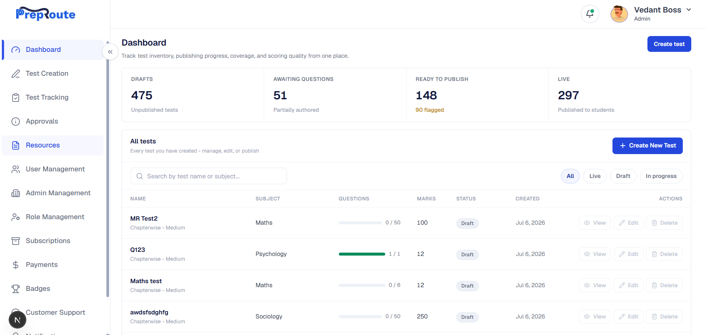
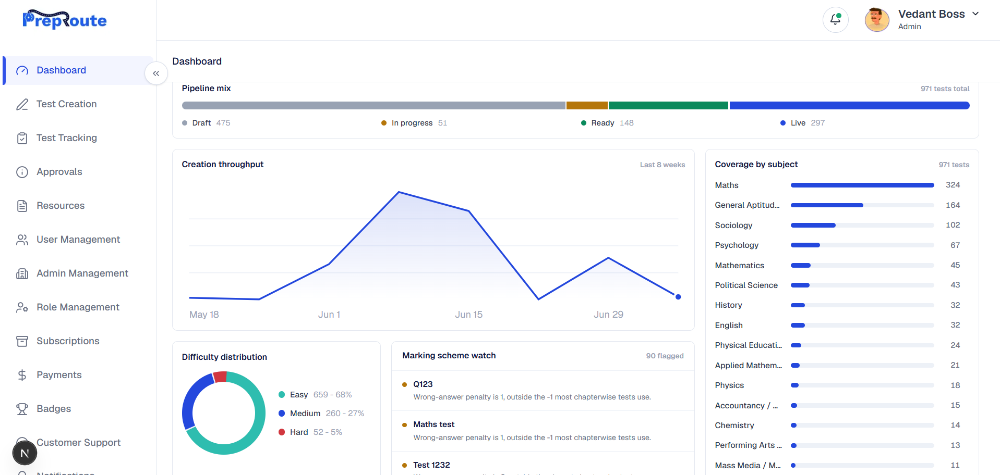
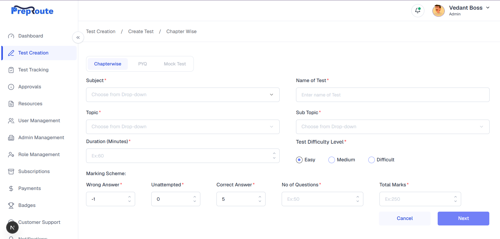
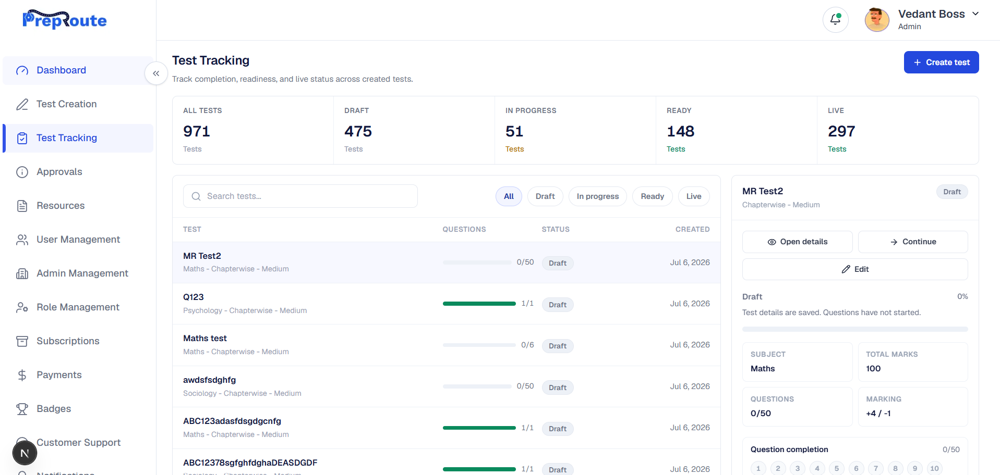

# Preproute Test Management

Preproute is an admin-facing test management application for creating,
tracking, editing, and publishing chapterwise MCQ tests. The project was built
as a frontend assignment against a provided Figma design language and documented
staging backend APIs.

The app includes the complete test authoring flow, a compact analytics
dashboard, and a Test Tracking workspace for inspecting created tests and
continuing work based on each test's status.

## Screens & Walkthrough

### Dashboard

The compact, data-driven dashboard renders live `GET /tests` data — KPI
overview, the full paginated test list, subject coverage, creation trend, and
publish/readiness signals.





### Test Creation

Subject / topic / sub-topic selection with cascading dropdowns, marking scheme,
difficulty, and question count.



### Test Tracking

Track created tests with pagination, search, status filters, on-demand detail
loading, and Continue / Edit / Publish handoff.



### Walkthrough video


https://github.com/user-attachments/assets/dcba52c6-c300-4edf-9a59-a535a05939c1


## What Was Implemented

- Authenticated login with the provided `userId` and password API.
- Protected admin shell with sidebar navigation, user menu, logout, and active-route states.
- Test details creation with subject, topics, sub-topics, type, difficulty, marking scheme, time, marks, and question count.
- MCQ question creation with local draft handling, validation, answer options, correct-answer selection, CSV import, and bulk question submission.
- Edit Test Details modal inside the question creation flow.
- Publish confirmation screen with completion gating and the documented `status: live` publish call.
- Dashboard with real test data, cached loading, compact metrics, test list, subject coverage, creation trend, and publish/readiness sections.
- Test Tracking route with pagination, search, status filters, lifecycle view, question completion, on-demand detail loading, and Continue/Edit/Publish handoff.
- API proxy routes so browser calls stay same-origin while the Next.js server forwards requests to the staging backend.

## Application Routes

| Route | Purpose |
| --- | --- |
| `/` | Login screen |
| `/dashboard` | Compact dashboard and operational overview |
| `/test-creation` | Create test metadata |
| `/question-creation` | Add questions and edit test details |
| `/publish-confirmation` | Review completion and publish |
| `/test-tracking` | Track created tests, inspect status, open details, continue/edit/publish |

## Tech Stack & Technical Decisions

| Choice | Why |
|---|---|
| **React 19 + TypeScript** | Required by the assignment brief; TypeScript catches payload/shape mismatches against the documented API responses at compile time. |
| **Next.js 16 (App Router)** | Gives file-based routing for the app routes plus local API route handlers for same-origin backend proxying. |
| **Local component state (`useState`), no global store** | Each screen owns its form/UI state. The cross-screen test and question handoff is persisted to `localStorage`, so Redux/Zustand/Context would add unnecessary complexity for this assignment-sized flow. |
| **Axios**, wrapped in `lib/api.ts` | Chosen over raw `fetch` for interceptor support: `lib/api.ts` registers a request interceptor that attaches the `Authorization: Bearer <token>` header to every backend call automatically (reading from `lib/auth.ts`), so individual call sites (`getSubjects`, `createTest`, `createQuestionsBulk`, etc.) don't repeat that boilerplate. It also normalizes both success and error response envelopes (`{ success, data, message, errors }`) into a single `ApiError` shape. |
| **Backend calls proxied through `app/api/backend/[...path]/route.ts`** | The staging backend doesn't need to be, and isn't, called directly from the browser. All `lib/api.ts` requests hit same-origin `/api/backend/*`, which the Next.js route handler forwards to `API_BASE_URL` (`lib/api-constants.ts`) server-side. This sidesteps CORS entirely and keeps the real backend URL out of client network calls. Login (`POST /auth/login`) instead goes through its own dedicated proxy at `/api/auth/login`. |
| **React Hook Form + Zod (`@hookform/resolvers`)** | Originally hand-rolled field validators were used for the login/test/question forms; these were deliberately refactored to React Hook Form + Zod schemas (`lib/validation/*.ts`) for declarative, type-safe validation and to cut down on repeated manual error-state wiring. |
| **Tailwind CSS v4** | Utility-first styling matching the Figma design system, with `tailwind-merge` / `class-variance-authority` for composable component variants (`components/ui/*`, shadcn-style primitives). |
| **date-fns, lucide-react, @base-ui/react** | Date formatting, icons, and unstyled accessible primitives (popover, calendar) underlying the custom UI components. |

## API Coverage

The frontend integrates the documented backend APIs through local Next.js proxy routes.

| API | Used For |
|---|---|
| `POST /auth/login` | Login and JWT retrieval |
| `GET /subjects` | Subject dropdown |
| `GET /topics/subject/:subjectId` | Topic dropdown |
| `POST /sub-topics/multi-topics` | Sub-topic dropdown |
| `POST /tests` | Create a test |
| `GET /tests` | Dashboard and Test Tracking list |
| `GET /tests/:id` | Test Tracking detail view |
| `PUT /tests/:id` | Edit test details and publish |
| `POST /questions/bulk` | Create questions in bulk |
| `POST /questions/fetchBulk` | Load full question detail for opened tests |

All authenticated API calls attach `Authorization: Bearer <token>` through the shared Axios client in `lib/api.ts`.

## CSV Question Import

Question creation supports client-side CSV import. Imported rows are converted
into the same local question drafts used by the manual MCQ editor, reviewed in
the UI, and then submitted through the existing `POST /questions/bulk` flow.

Use these headers:

```csv
question,option1,option2,option3,option4,correct_option,explanation,difficulty,topic,subtopic
```

Required columns are `question`, `option1`, `option2`, and `correct_option`.
`correct_option` accepts values like `option1`, `option2`, `A`, `B`, `1`, or
`2`. `option3`, `option4`, `explanation`, `difficulty`, `topic`, and `subtopic`
are optional. If topic/subtopic are blank, the current test defaults are used.

A ready sample is included at `docs/sample-questions.csv`.

## Getting Started

### Requirements

- Node.js `>=20.11.0`
- pnpm `>=11.0.0`

### Install

```bash
pnpm install
```

### Run Locally

```bash
pnpm dev
```

Open [http://localhost:3000](http://localhost:3000). The app lands on the login screen.

**Test credentials:**

```txt
userId: vedant-admin
password: vedant123
```

**Backend:** The app is pre-configured to talk to the staging backend at
`https://admin-moderator-backend-staging.up.railway.app/api` (see
`lib/api-constants.ts`). No `.env` setup is required to run locally - all
backend calls are routed through the local proxy route described above.

## Available Scripts

| Script | Description |
|---|---|
| `pnpm dev` | Start the local Next.js dev server on port 3000 |
| `pnpm build` | Create a production build |
| `pnpm start` | Serve the production build on port 3000 |
| `pnpm lint` | Run ESLint |
| `pnpm typecheck` | Run TypeScript without emitting files |
| `pnpm check` | Run lint and typecheck |
| `pnpm test:csv` | Run the CSV question import parser tests |
| `pnpm verify` | Run lint, typecheck, and production build |

## A Gotcha Worth Knowing

`package.json` pins `"zod": "4.0.0"` as an **exact** version, not a caret
range. This is intentional: `@hookform/resolvers@5.4.0`'s bundled type
definitions are incompatible with zod's newer 4.x point releases, which
breaks the TypeScript build if zod floats forward. Don't "helpfully" change
this to `^4.0.0` (or bump it) without first confirming `@hookform/resolvers`
has caught up - check `pnpm build` / `tsc --noEmit` after any change here.

## Project Structure

```txt
app/
  api/
    auth/login/route.ts
    backend/[...path]/route.ts
  dashboard/page.tsx
  publish-confirmation/page.tsx
  question-creation/page.tsx
  test-creation/page.tsx
  test-tracking/page.tsx
  page.tsx

components/
  dashboard/
  layout/
  login/
  publish-confirmation/
  question-creation/
  test-creation/
  test-tracking/
  ui/

lib/
  api.ts
  api-constants.ts
  auth.ts
  dashboard-cache.ts
  dashboard-data.ts
  dashboard-tests-client.ts
  question-draft.ts
  validation/

docs/
  screens/
```

## Validation And Verification

The project has been verified with:

```bash
pnpm typecheck
pnpm lint
pnpm build
```

Manual smoke checks were done on `localhost:3000` across login, test creation, question authoring, publish, dashboard, and test tracking.

## Current Boundaries

- Delete actions are not implemented because the provided API documentation does not include a delete endpoint.
- Schedule publish and custom live duration are UI/local state only; the documented publish API accepts `status: live`.
- CSV import is implemented client-side because no dedicated CSV backend endpoint was provided; imported rows are reviewed as drafts and saved with `POST /questions/bulk`.
- Rich-text formatting in question creation is client-side only and stored as HTML in local drafts before bulk submission.
- Dashboard test-list row actions (View/Edit) are disabled; use Test Tracking for continue/edit/publish handoff.
- Sidebar items beyond Dashboard, Test Creation, and Test Tracking show a "coming soon" toast and are outside assignment scope.
